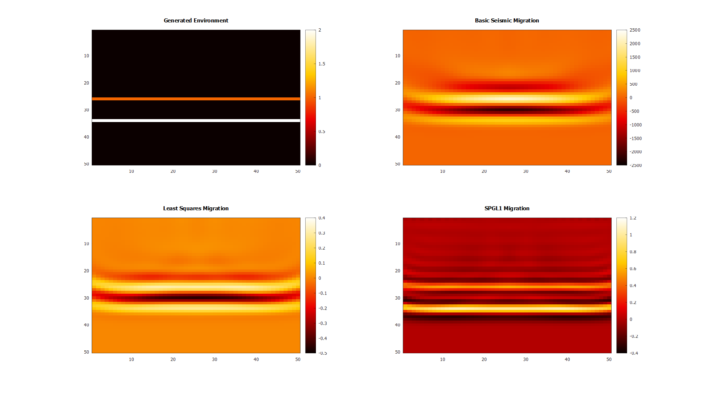

# Seismic Migration

 

 ## Description
This projects implements Kirchhoff prestack migration with the following methods:
- *Standard Migration* - Back-projects seismic traces to form an image of the subsurface with the adjoint operator
- *Least Squares Migration* - Least squares minimization between seismic reflectivity data and predicted seismic image
- *Compress Sensing Migration [1]* - Utilizes SPGL1[2] to perform a Basis Pursuit Denoing approach, promoting known sparsity in seismic data

Parallel computation is handled via *OpenMP* to accelerate the migration processes. Matplot++ is used for plotting output data. 

## References

1. Ali Aldawood, Ibrahim Hoteit, and Tariq Alkhalifah, (2014), "The possibilities of compressed-sensing-based Kirchhoff prestack migration," GEOPHYSICS 79: S113-S120. https://doi.org/10.1190/geo2013-0271.1
2. van den Berg, E., and M. P. Friedlander, 2007, SPGL1: A solver for large-scale sparse reconstruction, http://www.cs.ubc.ca/labs/scl/spgl1.

